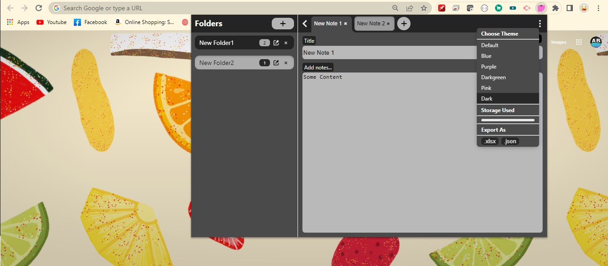

# This is a electron app to add notes, created using React

## Install Packages with: `npm install`

## To start react app: `npm run start-react`

## To build react app: `npm run build-react`

## To run the build with electron: `npm run start-electron`

## To build electron app: `npm run build`
